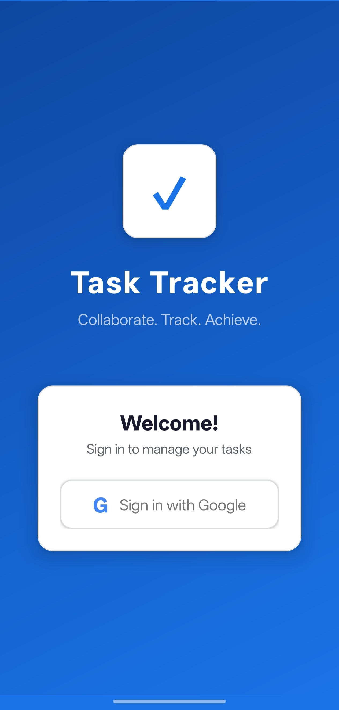
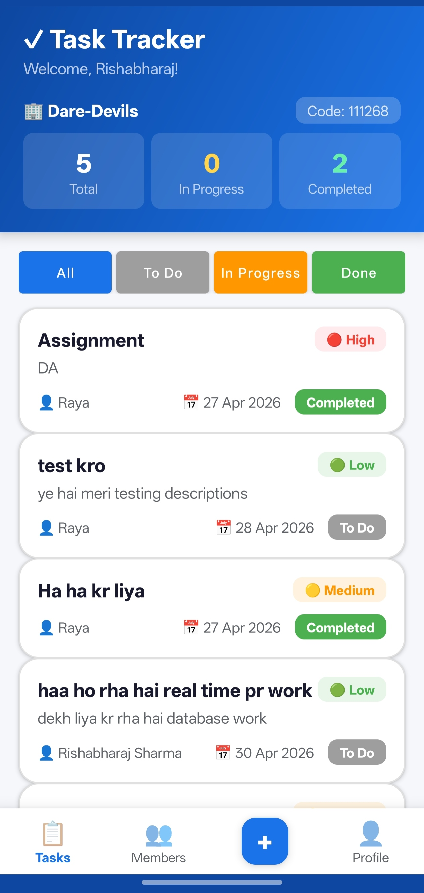
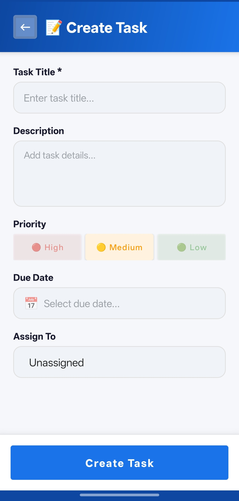
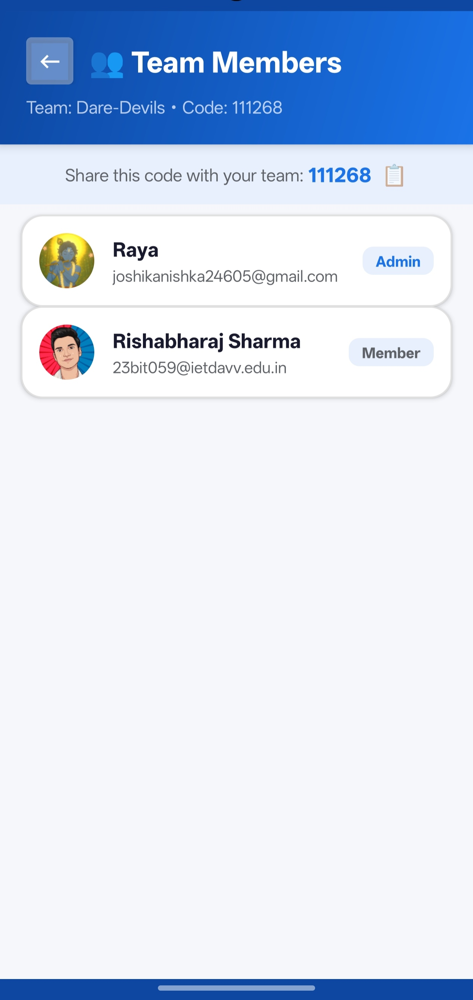
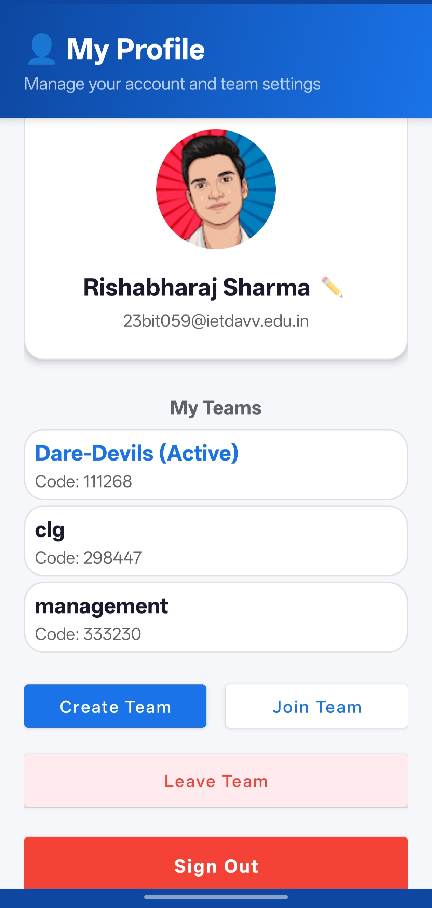
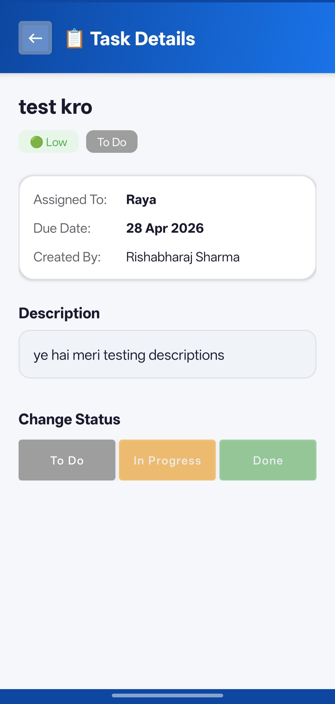

# 🚀 Team Task Tracker

<div align="center">


**A modern, real-time collaborative task management app for Android**

[Features](#features) • [Tech Stack](#tech-stack) • [Getting Started](#getting-started) • [Architecture](#architecture) • [Contributing](#contributing)

</div>

---

## � Screenshots

### 🔐 Login Screen
<div align="center">

</div>

The welcoming login screen is the first thing users see when opening the app. It features a clean, modern design with the app's motto "**Collaborate. Track. Achieve.**" Users can quickly sign in using their Google account with a single tap, providing secure OAuth 2.0 authentication without password management.

---

### 📊 Dashboard Hub
<div align="center">

</div>

The main dashboard is your command center! It displays:
- **Welcome message** personalized with your name
- **Team name and code** for easy sharing with teammates
- **Real-time statistics** showing Total Tasks, In Progress, and Completed count
- **Task filter tabs** (All, To Do, In Progress, Done) for quick navigation
- **Active task list** with priority indicators (High/Medium/Low), assignees, and due dates
- **Bottom navigation** to quickly switch between Tasks, Team Members, and Profile

All updates are **real-time** thanks to Firebase—when a teammate marks a task done, you see it instantly!

---

### ➕ Create Task Screen
<div align="center">

</div>

Adding new tasks is simple and intuitive! The Create Task form includes:
- **Task Title** - Give your task a clear name
- **Description** - Add detailed information about what needs to be done
- **Priority Levels** - Choose between High (Red), Medium (Yellow), or Low (Green)
- **Due Date Picker** - Set deadlines to keep the team on track
- **Assign To** - Delegate tasks to specific team members
- **Create Task Button** - One-tap to instantly sync with the entire team

The colorful priority indicators make it easy to spot urgent tasks at a glance!

---

### 👥 Team Members Screen
<div align="center">

</div>

The Team Members screen shows everyone in your team with:
- **Team name and unique code** at the top for easy reference
- **Shareable team code** with a copy button to invite new members
- **Member list** with circular profile pictures (pulled from Google accounts)
- **Member roles** - Clear indication of who's an Admin vs regular Member
- **Email addresses** displayed for easy contact

This is the place to manage your team, see who's on board, and share your team code with new collaborators. No complicated invitations—just share the code!

---

### 👤 My Profile Screen
<div align="center">

</div>

The Profile screen helps you manage your account and teams:
- **User profile card** with circular avatar (from Google account), name, and email
- **My Teams section** listing all teams you're part of with their team codes
- **Active team indicator** to show which team you're currently working with
- **Create Team button** - Start a new team for a different project
- **Join Team button** - Enter a code to join an existing team
- **Leave Team option** - Exit teams you're no longer part of
- **Sign Out button** - Securely log out from your account

Perfect for switching between multiple teams and managing your account settings!

---
### 📋 Task Details Screen
<div align="center">

</div>

The Task Details screen gives you a complete view of any task with all the important information:
- **Task title** at the top with a back button for easy navigation
- **Priority badge** (Low/Medium/High) with color coding (Green/Yellow/Red)
- **Current status** showing the task's current stage
- **Task metadata** card displaying:
  - **Assigned To** - Who is responsible for this task
  - **Due Date** - When the task needs to be completed
  - **Created By** - Who created the task
- **Full description** of what needs to be done
- **Quick status change buttons** with three options:
  - **To Do** (Gray) - Task not started
  - **In Progress** (Yellow) - Task is being worked on
  - **Done** (Green) - Task completed
  
One-tap status updates instantly notify all team members about progress!

---
## �📱 Overview

**Team Task Tracker** is a beautifully designed Android application that enables teams to collaborate seamlessly on task management. Whether you're working on a project with your team or managing daily tasks, this app provides real-time synchronization and an intuitive interface to keep everyone on the same page.

With Firebase Realtime Database, all team members see task updates **instantly** across all devices—no refreshing required! 🔄

---

## ✨ Features

### 🔐 Authentication
- **Google Sign-In Integration** - Secure, passwordless authentication using OAuth 2.0
- **Profile Management** - Automatic profile sync with Google accounts (Name, Email, Profile Picture)

### 👥 Team Collaboration
- **Create or Join Teams** - Start a new team or join existing ones using unique 6-digit team codes
- **Team Members View** - See all team members with their profile pictures and information
- **Multi-Tenant Architecture** - Complete data isolation between teams for privacy and security

### 📋 Task Management
- **Real-Time Task Updates** - All changes sync instantly across all connected devices
- **Priority Levels** - Organize tasks by High, Medium, and Low priority
- **Task Status Tracking** - Multiple status options to track task progress
- **Dashboard Overview** - Quick view of project statistics and active tasks

### 🎨 User Experience
- **Material Design UI** - Modern, intuitive interface following Google's Material Design guidelines
- **Responsive Layout** - Optimized for all Android devices (API 24+)
- **Efficient RecyclerView** - Smooth scrolling through tasks with optimized view recycling
- **Profile Picture Loading** - Fast, cached image loading using Glide library

---

## 🛠️ Tech Stack

### **Frontend**
- **Android** (Java) - Native Android development
- **Material Design Components** - Modern UI library
- **RecyclerView** - Efficient list rendering
- **CircleImageView** - Circular profile pictures
- **Glide** - Image loading and caching

### **Backend**
- **Firebase Authentication** - Secure user authentication with OAuth 2.0
- **Firebase Realtime Database** - Real-time data synchronization
- **Google Sign-In SDK** - Google account integration

### **Architecture & Concepts**
- **Event-Driven Programming** - ValueEventListeners for real-time updates
- **NoSQL Database** - Hierarchical JSON-like data structure
- **Asynchronous Processing** - Background thread handling for I/O operations
- **Explicit Intents** - Component communication between Activities
- **SharedPreferences** - Local persistent storage for team codes

---

## 🚀 Getting Started

### Prerequisites
- Android Studio (Arctic Fox or newer)
- Android SDK 34
- Java 17 or higher
- Firebase project setup

### Installation

1. **Clone the repository**
```bash
git clone https://github.com/rishabharaj/Team-task-tracker.git
cd Team-task-tracker
```

2. **Set up Firebase**
   - Go to [Firebase Console](https://console.firebase.google.com/)
   - Create a new project
   - Enable Firebase Authentication (Google Sign-In)
   - Enable Firebase Realtime Database
   - Download `google-services.json` and place it in the `app/` directory

3. **Configure Google Sign-In**
   - Get your SHA-1 certificate fingerprint:
   ```bash
   ./gradlew signingReport
   ```
   - Add this to your Firebase project settings

4. **Build and Run**
   - Open the project in Android Studio
   - Build the project: `Ctrl + F9` (or `Cmd + F9` on Mac)
   - Run on emulator or device: `Shift + F10`

---

## 📊 Application Architecture

### User Journey Flow

```
┌─────────────────┐
│   App Launch    │
└────────┬────────┘
         │
         ▼
    ┌─────────────────────┐
    │ Check User Session  │
    │   (FirebaseAuth)    │
    └────────┬────────────┘
             │
      ┌──────┴──────┐
      │             │
      ▼             ▼
 [Login] ──────▶ [Team Selection]
                      │
              ┌───────┴───────┐
              │               │
              ▼               ▼
         [Create Team] [Join Team]
              │               │
              └───────┬───────┘
                      ▼
              [Dashboard Hub]
                      │
         ┌────────────┼────────────┐
         │            │            │
         ▼            ▼            ▼
   [View Tasks] [Create Task] [Team Members]
```

### Database Structure

```
/teams
  /{teamCode}
    /members
      /{userId}
        - name
        - email
        - photoUrl
    /tasks
      /{taskId}
        - title
        - description
        - priority (High/Medium/Low)
        - status
        - assignedTo
        - createdBy
        - createdAt
```

### Key Components

| Activity | Purpose |
|----------|---------|
| `LoginActivity` | Google Sign-In entry point |
| `CreateTeamActivity` | Team creation/joining |
| `DashboardActivity` | Main hub with task overview |
| `CreateTaskActivity` | Add new tasks |
| `TeamMembersActivity` | View team members |

### Core Concepts Implemented

1. **Cloud-Based Authentication (OAuth 2.0)** - Secure, delegated authentication
2. **NoSQL Realtime Database** - JSON-like hierarchical data storage
3. **Event-Driven Programming** - ValueEventListeners for reactive updates
4. **ViewHolder Pattern** - Memory-efficient RecyclerView implementation
5. **Multi-Tenant Architecture** - Data isolation between teams
6. **Asynchronous Image Loading** - Background thread image fetching with caching

---

## 📲 Key Features in Detail

### Real-Time Synchronization
Updates to tasks are instantly reflected across all connected devices thanks to Firebase Realtime Database WebSocket connections.

### Team Codes
- Each team gets a unique 6-digit code
- Share the code with teammates to invite them
- No complicated authentication flows—just share and join!

### Profile Pictures
- Integrated with Google accounts
- Fast loading with Glide caching
- Circular profile images for a modern look

### Offline Support
- Some data is cached locally in SharedPreferences
- Once connected, Firebase automatically syncs changes

---

## 🔒 Security Highlights

- ✅ OAuth 2.0 authentication (no password storage)
- ✅ Firebase security rules enforce team data isolation
- ✅ HTTPS-only communication with Firebase
- ✅ Secure token management

---

## 📝 Build Configuration

- **Min SDK:** 24 (Android 7.0)
- **Target SDK:** 34 (Android 14)
- **Compile SDK:** 34
- **Java:** JDK 17

---

## 📦 Dependencies

```gradle
// Android & Material
androidx.appcompat:appcompat:1.6.1
com.google.android.material:material:1.11.0
androidx.constraintlayout:constraintlayout:2.1.4

// Firebase
com.google.firebase:firebase-auth
com.google.firebase:firebase-database

// Google Sign-In
com.google.android.gms:play-services-auth:20.7.0

// Image Loading
com.github.bumptech.glide:glide:4.16.0

// UI Components
de.hdodenhof:circleimageview:3.1.0
```

---

## 🤝 Contributing

We'd love your contributions! Here's how you can help:

1. **Fork the repository**
2. **Create a feature branch** (`git checkout -b feature/amazing-feature`)
3. **Commit your changes** (`git commit -m 'Add amazing feature'`)
4. **Push to the branch** (`git push origin feature/amazing-feature`)
5. **Open a Pull Request**

### Guidelines
- Follow Java coding conventions
- Add comments for complex logic
- Test your changes thoroughly
- Update documentation as needed

---

## 📚 Learning Resources

This project demonstrates:
- ✅ Modern Android development with Java
- ✅ Firebase integration (Auth & Realtime Database)
- ✅ Material Design implementation
- ✅ RecyclerView with custom adapters
- ✅ Real-time data synchronization
- ✅ Event-driven architecture
- ✅ Multi-tenant application design

Perfect for learning Android development best practices!

---

## 🐛 Issues & Feedback

Found a bug? Have a suggestion? [Open an issue](https://github.com/rishabharaj/Team-task-tracker/issues) on GitHub!

---

## 📄 License

This project is licensed under the MIT License - see the LICENSE file for details.

---

## 👨‍💻 About

Built with ❤️ by Rishabharaj

**GitHub:** [@rishabharaj](https://github.com/rishabharaj) and [@kanishka](https://github.com/KanishkaJoshi-20)

---

<div align="center">

### ⭐ If you find this project helpful, please consider giving it a star!

**Made with Android & Firebase** 🔥

</div>
